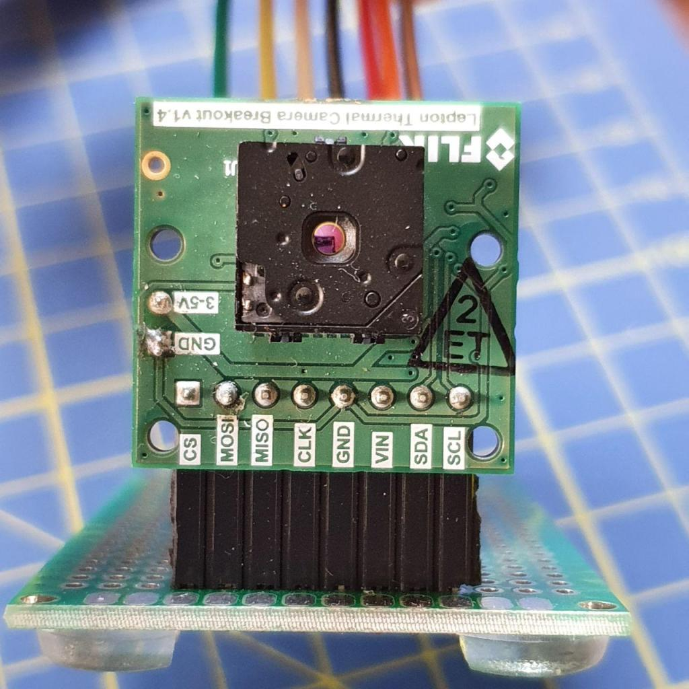
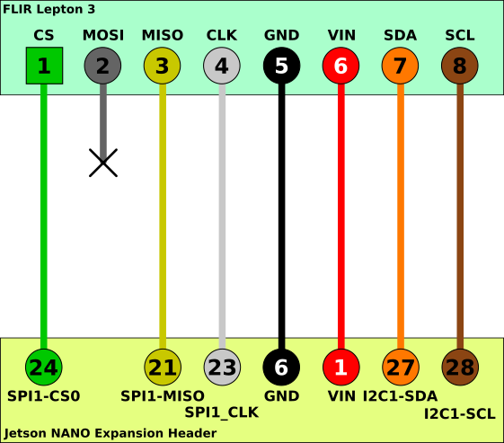
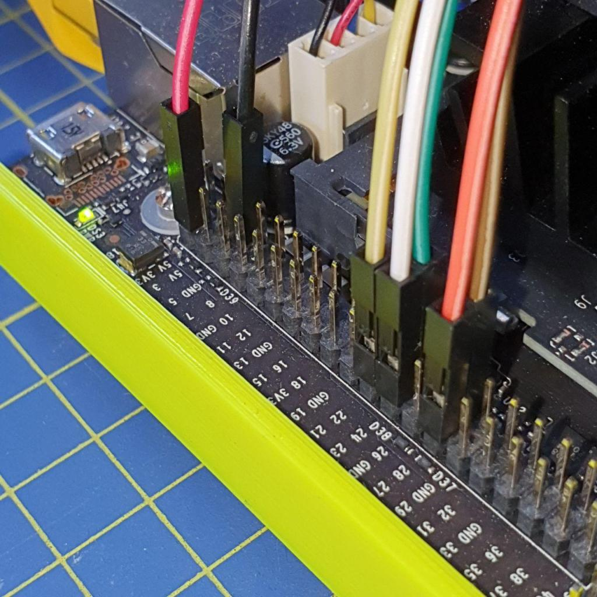
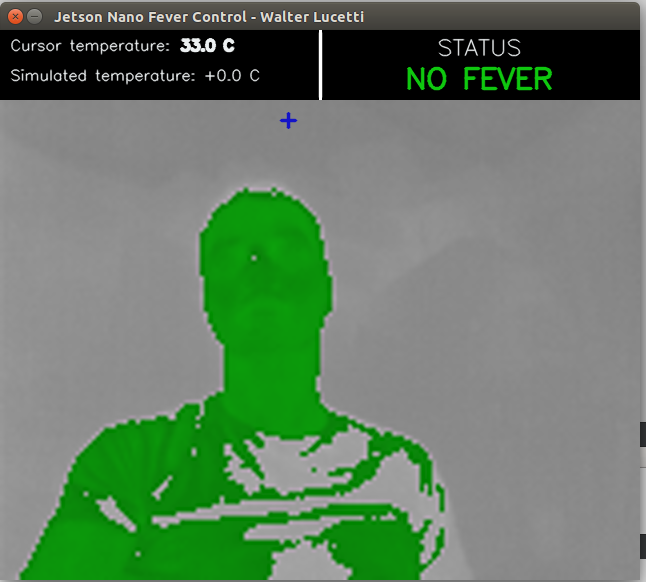
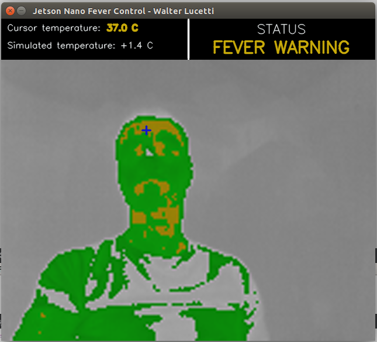
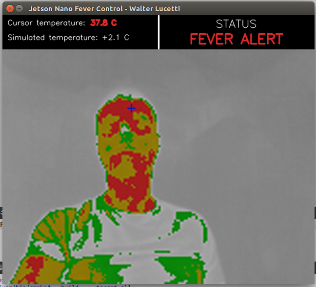

# Lepton3_Jetson (한글 번역)

FLIR Lepton3 열화상 카메라를 Nvidia Jetson 임베디드 보드에 연결하는 라이브러리 및 예제



자세한 내용은 Myzhar 블로그 [포스트](https://www.myzhar.com/blog/jetson-nano-with-flir-lepton3/) 참고

## 사전 준비물

* [Flir Lepton 3 모듈](https://www.flir.it/products/lepton/?model=500-0276-01) (Lepton 3.5도 사용 가능)
* [Getlab의 Breakout Board v1.4](https://groupgets.com/manufacturers/getlab/products/flir-lepton-breakout-board-v1-4)
* [Nvidia Jetson 보드](https://www.nvidia.com/en-us/autonomous-machines/jetson-store/) (Jetson Nano + Jetpack 3.3에서 테스트)
* 예제 컴파일용 OpenCV 라이브러리
* CMake 2.8.9 이상

**참고**: [이 이슈](https://github.com/Myzhar/Lepton3_Jetson/issues/14)에서 @ma-ludw가 지적했듯이, Jetson Nano의 성능을 극대화하고 프레임 손실을 줄이려면 `jetson_clocks.sh` 스크립트 실행을 권장합니다.

## 소프트웨어 설치

빌드 필수 패키지 설치

```
sudo apt install build-essential g++ libopencv-dev
```

### 최신 CMake 설치

최소 CMake 3.15 필요. 현재 버전 확인:

```
cmake --version
```

CMake 3.18 소스 다운로드:

```
version=3.18
build=1
mkdir ~/temp
cd ~/temp
wget https://cmake.org/files/v$version/cmake-$version.$build.tar.gz
tar -xzvf cmake-$version.$build.tar.gz
cd cmake-$version.$build/
```

빌드 및 설치:

```
./bootstrap
make -j$(nproc)
sudo make install
```

*참고*: `OpenSSL` 관련 에러가 나면 아래 명령으로 설치:
```
sudo apt-get install libssl-dev
```

설치 확인:
```
cmake --version
```

### 프로젝트 빌드

저장소 클론

```
git clone https://github.com/Myzhar/Lepton3_Jetson.git
```

컴파일

```
mkdir build
cd build
cmake ..
make
cd ..
```

## 카메라 연결



Lepton3 모듈을 Nvidia Jetson Nano에 연결하는 자세한 방법은 [Myzhar 블로그](https://www.myzhar.com/blog/?p=4500) 참고



### SPI 버퍼 크기 변경

spidev 모듈의 기본 SPI 버퍼 크기는 4096바이트입니다. Lepton3는 열화상 이미지를 완전히 수신하려면 20KB 버퍼가 필요합니다.

Jetson Nano에서 SPI 버퍼 크기 변경 방법은 [Myzhar 블로그](https://www.myzhar.com/blog/jetson-nano-with-flir-lepton3/#Change_SPI_buffer_size) 참고

## 데모 실행

`build/grabber_lib` 폴더에 있는 `lepton3_grabber` 정적 라이브러리 사용 예제가 2개 제공됩니다.

### OpenCV 데모

OpenCV로 열화상 스트림을 표시하고 카메라 동작을 제어하는 샘플입니다.

```
cd build/opencv_demo
./opencv_demo
```

키보드 명령:
* `c` → RGB 모드(24비트 컬러 이미지)
* `r` → Radiometry 모드(16비트 그레이, 14비트 선형 온도값)
* `h` → High gain 모드(-10°C~140°C, 5°C 정확도)
* `l` → Low gain 모드(-10°C~400°C, 10°C 정확도)
* `a` → Auto gain 모드
* `f` → FFC 정규화
* `F` → FFC 방사선 정규화

### Fever control demo

16비트 그레이 이미지를 이용해 사람의 온도를 추정하고, 발열(고열) 시 알람을 발생시키는 데모입니다. (COVID19 시기 보안 샘플로 제작)

```
cd build/check_fever_app
./check_fever_app
```

키보드 `u`/`d`로 추정 온도를 올리거나 내릴 수 있습니다(발열 시뮬레이션).

YouTube 데모 영상: [링크](https://youtu.be/SFStaq--3-U)

 |  | 
